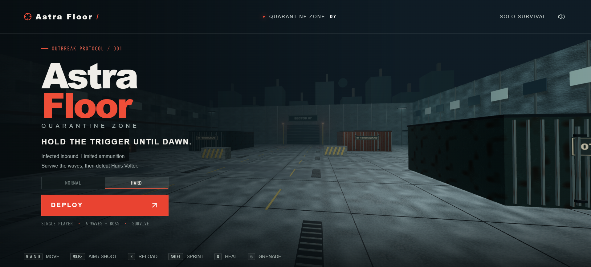

# Astra Floor

English | [日本語](README.jp.md)

> A fast-paced, single-player 3D zombie survival FPS running natively in modern web browsers with zero external asset downloads.  
> 🎮 **Play Online**: **[https://astrafloor.berochlu.workers.dev/](https://astrafloor.berochlu.workers.dev/)**

[](https://astrafloor.berochlu.workers.dev/)
[](https://www.typescriptlang.org/)
[](https://react.dev/)
[](https://threejs.org/)
[](https://vitejs.dev/)
[](#running-automated-tests)



---

## Table of Contents

- [Overview](#overview)
- [Key Features](#key-features)
- [Basic Gameplay & Controls](#basic-gameplay--controls)
- [Essential Survival Tactics](#essential-survival-tactics)
- [Weapon Arsenal](#weapon-arsenal)
- [Difficulty Modes](#difficulty-modes)
- [Setup & Development](#setup--development)
- [Detailed Specifications](#detailed-specifications)

---

## Overview

**Astra Floor** is a single-player 3D zombie survival first-person shooter designed specifically for PC keyboard and mouse.
- **Play Online in Browser**: **[https://astrafloor.berochlu.workers.dev/](https://astrafloor.berochlu.workers.dev/)**

Set in an apocalyptic quarantined industrial complex, players must eliminate unrelenting waves of anomalous mutants known as "Zods". Clear each wave, earn credits (₡), and upgrade your firearms, armor, and gear in the supply shop between rounds. Survive Waves 1 through 6, then defeat the **Final Boss** in Wave 7 to win. You lose when your HP reaches zero.

*Note: There is no save feature. Reloading the page, retrying, or returning to the title resets run progression.*

---

## Key Features

- **Pure Browser-Native 3D FPS**  
  Runs smoothly inside modern web browsers via **Three.js** and **React 19 / vinext** without installing client binaries, plugins, or extensions.
- **100% In-Memory Procedural Assets**  
  Weapon models, environmental architecture, mutant body geometry, and 128–256px PBR texture sets (albedo, normal, roughness) are synthesized dynamically in memory at startup. No external 3D asset downloads.
- **Pure Web Audio API Sound Synthesis**  
  Every sound effect—explosive gunshots, crisp sniper bolt mechanisms, rocket thrusters and detonations, bullet impacts, ricochets, monster growls, and the final boss's mechanical voice—is synthesized in real-time using Web Audio oscillators, noise buffers, biquad filters, and master dynamic compressors.
- **Authentic FPS Recoil & Gunplay**  
  True recoil mechanics: each fired round kicks the camera pitch and yaw upwards and sideways. **The crosshair does not automatically snap back down.** Players must manually compensate with the mouse. Headshots deal **3.0× lethal damage** across all firearms and direct rocket strikes.

---

## Basic Gameplay & Controls

Controls are kept minimal and standard so PC FPS players can immediately adapt.

### Keybindings (PC Keyboard & Mouse)

| Action | Key / Input | Notes |
|---|---|---|
| **Movement** | `W` `A` `S` `D` | Omnidirectional combat movement |
| **Look / Aim** | `Mouse` | Pointer-locked aim with manual recoil compensation |
| **Fire Weapon** | `Left Click` | Semi-auto or full-auto depending on equipped weapon |
| **Aim Down Sights (ADS)** | `Right Click` (Hold) | Tighter bullet spread, reduced recoil kick, 5× sniper optic |
| **Sprint** | `Left Shift` | Drains 20 stamina/s (unavailable while aiming) |
| **Jump** | `Space` | Vault obstacles and dodge low attacks |
| **Reload** | `R` | Reloads weapon magazine |
| **Weapon Selection** | `1` `2` `3` `4` | `1`: Handgun/G18C, `2`: Assault Rifle, `3`: Sniper Rifle, `4`: RPG-7 |
| **Melee Attack** | `V` | Blunt bash (default) / Katana fan sweep (after upgrade) |
| **Throw Grenade** | `G` | Parabolic toss; explodes 1.0s after release (self-damage enabled) |
| **Use Medical Kit** | `Q` | Instantly heals 50 HP (10s cooldown, max 3 held) |
| **Pause** | `Esc` | Releases pointer and pauses combat (choose **RESUME COMBAT** to resume) |
| **Wave Clear Advance** | `Space` / `Enter` | Advances from victory screen into preparation shop |
| **Debug Settings Panel** | `F8` | Title screen only; select wave, starting cash, and 1 HP floor |

### Game Progression & Supply Shop

1. **Combat Waves**: Eliminate all active Zods to clear the wave.
2. **Automatic Health Restoration**: Clearing a wave restores player HP to 100. Armor, ammunition, and consumables are not restored automatically.
3. **Preparation Shop**:
   - Earn credits (₡) from enemy kills and wave completion bonuses.
   - The shop has no timer. Purchase weapons, damage upgrades, ammunition refills, armor reinforcement, Medical Kits, and grenades.
   - All equipment, upgrades, credits, and remaining supplies carry over to subsequent waves.
   - When ready, press **NEXT WAVE** (or **FACE FINAL BOSS** before Wave 7) to deploy.

---

## Essential Survival Tactics

- **Armor Protection**  
  Max HP and Armor are both 100. Body Armor absorbs 100% of incoming damage before health is reduced. Keeping your armor reinforced at the shop is vital to surviving later waves.
- **Movement Shooting & Melee Swiping**  
  Strafe-shooting while on the move and utilizing melee attacks (`V`) to cut through zombie swarms are essential to avoid getting cornered.
- **Sprint Away From Charges**  
  Sprint (`Left Shift`) laterally when large Zods roar and charge. Never stand still.
- **Recoil Control & Headshots**  
  Aim for heads to deal 3.0× damage. Manually pull the mouse down to compensate for automatic weapon recoil.
- **Medical Kit Timing**  
  Use `Q` when your health takes a hit (heals 50 HP, 10s cooldown, max 3 stored).
- **Beware of Blast Self-Damage**  
  Frag grenades (`G`) and RPG-7 rockets deal heavy self-damage within 7 meters. Keep your distance or take cover.

---

## Weapon Arsenal

| Weapon | Slot | Role & Special Traits |
|---|:---:|---|
| **H1 Service Pistol** | 1 | Starting semi-auto sidearm. 12-round magazine, precise accuracy, and 3.0× headshot multiplier |
| **G18C Machine Pistol** | 1 | Shop upgrade (₡750). 33-round extended magazine spitting ~882 RPM rapid full-auto fire |
| **AR-2 Assault Rifle** | 2 | Shop purchase (₡800). 30-round sustained full-auto rifle; ideal for mid-range fire suppression |
| **SR-3 Sniper Rifle** | 3 | Shop purchase (₡1,100). High-damage bolt-action rifle with 5× scope and up to 3-target penetration |
| **RPG-7 Rocket Launcher** | 4 | Shop purchase (₡4,000). 60 m/s straight-flying rocket with 600 blast damage, 3.0× direct headshots, and auto-reload |
| **Katana** | `V` | Shop upgrade (₡1,000). 4.2m reach completely flat horizontal fan sweep dealing 110 base damage to multiple enemies |
| **Ammo Pouch** | Upgrade | Shop purchase (₡1,000). +50% reserve ammunition capacity, +2 grenade slots. Instantly refills all ammo and grenades |

---

## Difficulty Modes

| Difficulty | Starting Point | Starting Credits | Features |
|---|---|:---:|---|
| **Normal Mode** | Wave 1 combat | ₡500 | Standard enemy HP, movement speed, and spawn rates. Balanced for standard play |
| **Hard Mode** | Wave 1 cleared shop (Wave 2 prep) | ₡2,000 | Faster, tougher Zods with aggressive spawn frequency. Prepare loadout before Wave 2 |

*Both difficulties initialize with full HP, full Armor, full ammunition, and full grenades.*  
*Press **`F8`** on the title screen to access developer debug deployment options (select Wave 1–7, custom credits, and minimum 1 HP mode).*

---

## Setup & Development

### Requirements

- **Node.js**: `>= 22.13.0`
- **Package Manager**: `npm`

### Installation & Local Server

```bash
# Clone the repository
git clone https://github.com/username/astrafloor.git
cd astrafloor

# Install dependencies
npm install

# Start local development server
npm run dev
```

Open [http://localhost:3000](http://localhost:3000) in your browser. Click the screen to lock the pointer and begin.

### Running Automated Tests

Run the full automated test suite (136 unit tests):

```bash
npm test
```

### Type Checking & Production Build

```bash
# TypeScript type check
npx tsc --noEmit

# Build production bundle (Cloudflare Worker, SSR, RSC, client assets)
npm run build
```

---

## Detailed Specifications

For in-depth mathematical formulas, weapon ballistics, enemy HP/damage profiles, and boss combat phases, consult the reference specifications:

- **Developer Reference & Detailed Specs**: [English](docs/game-details.md) | [日本語](docs/game-details.jp.md)

---

## License

This project is licensed under the [MIT License](LICENSE).
