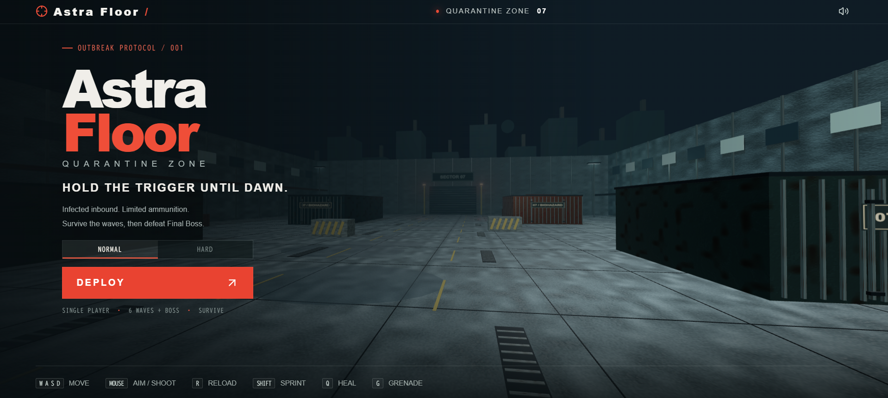

# Astra Floor

English | [日本語](README.jp.md)

> A fast-paced, single-player 3D zombie survival FPS running natively in modern web browsers with zero external asset downloads.  
> 🤖 Built with **ChatGPT Plus (GPT-6 Astra)** and **Antigravity 2.0**.  
> 🎮 **Play Online**: **[https://astrafloor.berochlu.workers.dev/](https://astrafloor.berochlu.workers.dev/)**

[](https://astrafloor.berochlu.workers.dev/)
[](https://www.typescriptlang.org/)
[](https://react.dev/)
[](https://threejs.org/)
[](https://vitejs.dev/)
[](#running-automated-tests)



---

## Table of Contents

- [Overview](#overview)
- [Key Features](#key-features)
- [Basic Gameplay & Controls](#basic-gameplay--controls)
- [Essential Survival Tactics](#essential-survival-tactics)
- [Weapon Arsenal](#weapon-arsenal)
- [Difficulty Modes](#difficulty-modes)
- [Setup & Development](#setup--development)
- [Detailed Specifications](#detailed-specifications)
- [Credits & AI Development](#credits--ai-development)

---

## Overview

**Astra Floor** is a single-player 3D zombie survival first-person shooter designed specifically for PC keyboard and mouse.  
Set in an apocalyptic quarantined industrial complex, players must eliminate unrelenting waves of anomalous mutants known as "Zods". Clear each wave, earn credits (₡), and upgrade your firearms, armor, and gear in the supply shop between rounds. Survive Waves 1 through 6, then defeat the **Final Boss** in Wave 7 to win. You lose when your HP reaches zero.

*Note: There is no save feature. Reloading the page, retrying, or returning to the title resets run progression.*

---

## Key Features

- **Pure Browser-Native 3D FPS**  
  Runs smoothly inside modern web browsers via **Three.js** and **React 19 / vinext** without installing client binaries, plugins, or extensions.
- **100% In-Memory Procedural Assets**  
  Weapon models, environmental architecture, mutant body geometry, and 128–256px PBR texture sets (albedo, normal, roughness) are synthesized dynamically in memory at startup. No external 3D asset downloads.
- **Pure Web Audio API Sound Synthesis**  
  Every sound effect—explosive gunshots, crisp sniper bolt mechanisms, rocket thrusters and detonations, bullet impacts, ricochets, monster growls, and the final boss's mechanical voice—is synthesized in real-time using Web Audio oscillators, noise buffers, biquad filters, and master dynamic compressors.
- **Authentic FPS Recoil & Gunplay**  
  Every shot produces strong recoil. Players must pull the mouse down to compensate. Headshots with any firearm or a direct rocket strike deal devastating damage.

---

## Basic Gameplay & Controls

Controls use a simple, familiar PC FPS layout to help newcomers get comfortable with keyboard input.

**Headshots deal 3× normal damage.** Aim for enemy heads with bullets or direct RPG-7 rocket strikes to take them down more efficiently.

### Keybindings (PC Keyboard & Mouse)

| Action | Key / Input | Notes |
|---|---|---|
| **Movement** | `W` `A` `S` `D` | Omnidirectional combat movement |
| **Look / Aim** | `Mouse` | Pointer-locked aim with manual recoil compensation |
| **Fire Weapon** | `Left Click` | Semi-auto or full-auto depending on equipped weapon |
| **Aim Down Sights (ADS)** | `Right Click` (Hold) | Tighter bullet spread, reduced recoil kick, 5× sniper optic |
| **Sprint** | `Left Shift` | Drains 20 stamina/s (unavailable while aiming) |
| **Jump** | `Space` | Vault obstacles and dodge low attacks |
| **Reload** | `R` | Reloads weapon magazine |
| **Weapon Selection** | `1` `2` `3` `4` | `1`: Handgun/G18C, `2`: Assault Rifle, `3`: Sniper Rifle, `4`: RPG-7 |
| **Melee Attack** | `V` | Blunt bash (default) / Katana fan sweep (after upgrade) |
| **Throw Grenade** | `G` | Parabolic toss; explodes 1.0s after release (self-damage enabled) |
| **Use Medical Kit** | `Q` | Instantly heals 50 HP (8s cooldown, max 3 held) |
| **Pause** | `Esc` | Releases pointer and pauses combat (choose **RESUME COMBAT** to resume) |
| **Wave Clear Advance** | `Space` / `Enter` | Advances from victory screen into preparation shop |

### Game Progression & Supply Shop

1. **Combat Waves**: Eliminate all active Zods to clear the wave.
2. **Automatic Health Restoration**: Clearing a wave restores player HP to 100. Armor, ammunition, and consumables are not restored automatically.
3. **Preparation Shop**:
   - Earn credits (₡) from enemy kills and wave completion bonuses.
   - The shop has no timer. Purchase weapons, weapon upgrades, ammunition refills, armor reinforcement, Medical Kits, and grenades.
   - All equipment, upgrades, credits, and remaining supplies carry over to subsequent waves.
   - When ready, press **NEXT WAVE** (or **FACE FINAL BOSS** before Wave 7) to deploy.

---

## Essential Survival Tactics

- **Strafe-Shooting & Katana Breakouts**  
  Strafe-shooting while staying mobile and slashing through swarms with the Katana (`V` key, once purchased from the shop) are essential techniques to escape zombie encirclements.
- **Evade Charges with Sprinting**  
  If enemies surround you or charge, keep moving and sprint (`Left Shift`) to slip away.
- **Precision Recoil Control & Headshots**  
  Actively aim for headshots. Manually pull down your mouse during sustained fire to suppress muzzle climb.
- **Line Up Penetration Shots with the SR-3**  
  The SR-3 Sniper Rifle penetrates up to 3 targets. Line up headshots to take down troublesome or clustered enemies simultaneously.
- **Use Grenades & Medical Kits Generously**  
  Frag Grenades (`G`) and Medical Kits (`Q`) can be cheaply restocked in the shop, so do not hesitate to use them before turning into a critical situation.
- **Watch Out for Colossal Enemies**  
  The colossal enemies appearing in Waves 5–6 will enrage and charge after a short time. Quickly take cover behind obstacles or prioritize headshots from long range to bring them down as fast as possible.

---

## Weapon Arsenal

| Weapon | Slot | Role & Special Traits |
|---|:---:|---|
| **H1 Service Pistol** | 1 | Starting semi-auto sidearm with a 12-round magazine |
| **G18C Machine Pistol** | 1 | Shop upgrade (₡750). 33-round extended magazine spitting ~882 RPM rapid full-auto fire |
| **AR-2 Assault Rifle** | 2 | Shop purchase (₡800). 30-round sustained full-auto rifle; ideal for mid-range fire suppression |
| **SR-3 Sniper Rifle** | 3 | Shop purchase (₡1,100). High-damage bolt-action rifle (5-round magazine, 18 reserve) with 5× scope and up to 3-target penetration |
| **RPG-7 Rocket Launcher** | 4 | Shop purchase (₡4,000). Straight-flying rockets at 60 m/s with a wide-area blast |
| **Katana** | `V` | Shop upgrade (₡1,000). A horizontal fan sweep with 3.9m reach that strikes multiple enemies in front of you |
| **Ammo Pouch** | Upgrade | Shop purchase (₡1,000). +50% reserve ammunition capacity, +2 grenade slots. Instantly refills all ammo and grenades |
| **Weapon Upgrade** | Upgrade | Shop purchase (Lv. 1: ₡1,000 / Lv. 2: ₡2,000). Increases all firearm bullet and melee damage by +35% per tier (up to Lv. 2 / +70% total, except explosive) |

---

## Difficulty Modes

| Difficulty | Starting Point | Starting Credits | Features |
|---|---|:---:|---|
| **Normal Mode** | Wave 1 combat | ₡500 | Standard enemy HP, movement speed, and spawn rates. For beginner to intermediate FPS players |
| **Hard Mode** | Wave 1 cleared shop (Wave 2 prep) | ₡2,000 | Increased enemy HP, movement speed, and spawn rates. For advanced players; use the starting credits to prepare your loadout |

*Both difficulties initialize with full HP, full Armor, full ammunition, and full grenades.*  

---

## Setup & Development

### Requirements

- **Node.js**: `>= 22.13.0`
- **Package Manager**: `npm`

### Installation & Local Server

```bash
# Clone the repository
git clone https://github.com/username/astrafloor.git
cd astrafloor

# Install dependencies
npm install

# Start local development server
npm run dev
```

Open [http://localhost:3000](http://localhost:3000) in your browser. Click the screen to lock the pointer and begin.

### Running Automated Tests

Run the full automated test suite (140 unit tests):

```bash
npm test
```

### Type Checking & Production Build

```bash
# TypeScript type check
npx tsc --noEmit

# Build production bundle (Cloudflare Worker, SSR, RSC, client assets)
npm run build
```

---

## Detailed Specifications

For in-depth mathematical formulas, weapon ballistics, enemy HP/damage profiles, and boss combat phases, consult the reference specifications:

- **Developer Reference & Detailed Specs**: [English](docs/game-details.md) | [日本語](docs/game-details.jp.md)

---

## Credits & AI Development

**Astra Floor** was created and implemented with **ChatGPT Plus (GPT-6 Astra)** and **Antigravity 2.0**.

---

## License

This project is licensed under the [MIT License](LICENSE).
