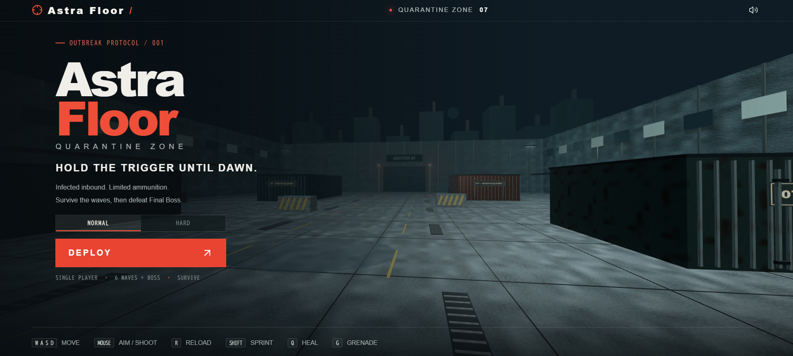

# Astra Floor

English | [日本語](README.jp.md)

> A single-player 3D zombie survival FPS for modern web browsers, using procedural models plus bundled textures and music.\
> 🤖 Built with **ChatGPT Plus (GPT-6 Astra)** and **Antigravity 2.0**.  
> 🎮 **Play Online**: **[https://astrafloor.berochlu.workers.dev/](https://astrafloor.berochlu.workers.dev/)**

[](https://astrafloor.berochlu.workers.dev/)
[](https://www.typescriptlang.org/)
[](https://react.dev/)
[](https://threejs.org/)
[](https://vitejs.dev/)
[](#running-automated-tests)



---

## Table of Contents

- [Overview](#overview)
- [Key Features](#key-features)
- [Basic Gameplay & Controls](#basic-gameplay--controls)
- [Essential Survival Tactics](#essential-survival-tactics)
- [Weapon Arsenal](#weapon-arsenal)
- [Difficulty Modes](#difficulty-modes)
- [Setup & Development](#setup--development)
- [Detailed Specifications](#detailed-specifications)
- [Credits & AI Development](#credits--ai-development)

---

## Overview

**Astra Floor** is a single-player 3D zombie survival first-person shooter designed specifically for PC keyboard and mouse.  
Set in an apocalyptic quarantined industrial complex, players must eliminate unrelenting waves of anomalous mutants known as "Zods". Clear each wave, earn credits (₡), and purchase weapons, upgrades, armor refills, and supplies in the shop between rounds. Survive Waves 1 through 6, then defeat the **Final Boss, Hans Volter**, in Wave 7 to win. You lose when your HP reaches zero.

*Note: There is no save feature. Reloading the page, retrying, or returning to the title resets run progression.*

---

## Key Features

- **Pure Browser-Native 3D FPS**  
  Runs inside WebGL-compatible desktop browsers via **Three.js** and **React 19 / vinext** without installing client binaries, plugins, or extensions.
- **Procedural Models and Bundled PBR Textures**\
  Weapon models, environmental architecture, and enemy geometry are built in code. Floor and wall materials load bundled 2048×2048 albedo, normal, and roughness maps from `public/textures/environment/`; enemy materials load bundled maps from `public/textures/enemies/`. Procedural 128–256px maps provide fallback materials. Assets are served by the game; gameplay does not fetch assets from third-party sites. See the [environment texture credits](public/textures/environment/README.md).
- **Synthesized Sound Effects and Bundled Music**\
  Combat and weapon sound effects, enemy voices, and the Siren's scream are synthesized using Web Audio oscillators, noise buffers, filters, and a master compressor. Background music loops the bundled `public/audio/zombgm.ogg` file after deployment. The music button toggles BGM, and the speaker button mutes all audio.
- **Weapons Prepared Before Deployment**\
  All six weapon models (H1, G18C, AR-2, SR-3, RPG-7, and Katana) and their rendering resources are prepared before normal or debug deployment. The start button displays **INITIALIZING...** until preparation finishes.
- **Authentic FPS Recoil & Gunplay**  
  Every shot produces strong recoil. Players must pull the mouse down to compensate. Headshots with any firearm or a direct rocket strike deal devastating damage.

---

## Basic Gameplay & Controls

Controls use a simple, familiar PC FPS layout to help newcomers get comfortable with keyboard input.

**Headshots deal 3× normal damage.** Aim for enemy heads with bullets or direct RPG-7 rocket strikes to take them down more efficiently.

### Keybindings (PC Keyboard & Mouse)

| Action | Key / Input | Notes |
|---|---|---|
| **Movement** | `W` `A` `S` `D` | Omnidirectional combat movement |
| **Look / Aim** | `Mouse` | Pointer-locked aim with manual recoil compensation |
| **Fire Weapon** | `Left Click` | Semi-auto or full-auto depending on equipped weapon |
| **Aim Down Sights (ADS)** | `Right Click` (Hold) | Tighter bullet spread, reduced recoil kick, 5× sniper optic |
| **Sprint** | `Left Shift` | Drains 20 stamina/s (unavailable while aiming) |
| **Jump** | `Space` | Jump while moving or standing |
| **Reload** | `R` | Reloads weapon magazine |
| **Weapon Selection** | `1` `2` `3` `4` | `1`: Handgun/G18C, `2`: Assault Rifle, `3`: Sniper Rifle, `4`: RPG-7 |
| **Melee Attack** | `V` | Blunt bash (default) / Katana fan sweep (after upgrade) |
| **Throw Grenade** | `G` | Parabolic toss; explodes 1.0s after release (self-damage enabled) |
| **Use Medical Kit** | `Q` | Instantly heals 50 HP (8s cooldown, max 3 held) |
| **Pause** | `Esc` | Releases pointer and pauses combat (choose **RESUME COMBAT** to resume) |
| **Wave Clear Advance** | `Space` / `Enter` | Advances from victory screen into preparation shop |
| **Debug Configuration** | `F8` (title screen) | Choose difficulty, starting wave, credits, and optional minimum 1 HP |

### Game Progression & Supply Shop

1. **Combat Waves**: Eliminate all active Zods to clear the wave.
2. **Automatic Health Restoration**: Clearing a wave restores player HP to 100. Armor, ammunition, and consumables are not restored automatically.
3. **Preparation Shop**:
   - Earn credits (₡) from enemy kills and wave completion bonuses.
   - The shop has no timer. Purchase weapons, weapon upgrades, ammunition refills, armor refills, Medical Kits, and grenades.
   - All equipment, upgrades, credits, and remaining supplies carry over to subsequent waves.
   - When ready, press **NEXT WAVE** (or **FACE FINAL BOSS** before Wave 7) to deploy.

Armor absorbs incoming damage until depleted, except for Siren screams, which damage HP directly. Pausing freezes combat and retains the game view behind the pause menu.

On the title screen, **F8** opens debug configuration. Select Normal or Hard, any starting wave from 1–7, and ₡0–30,000 in steps of ₡1,000 (default ₡15,000). **INVULNERABILITY** keeps HP at or above 1. Debug deployment opens the supply shop before the selected wave.

---

## Essential Survival Tactics

- **Strafe-Shooting & Katana Breakouts**  
  Strafe-shooting while staying mobile and slashing through swarms with the Katana (`V` key, once purchased from the shop) are essential techniques to escape zombie encirclements.
- **Evade Charges with Sprinting**  
  If enemies surround you or charge, keep moving and sprint (`Left Shift`) to slip away.
- **Precision Recoil Control & Headshots**  
  Actively aim for headshots. Manually pull down your mouse during sustained fire to suppress muzzle climb.
- **Line Up Penetration Shots with the SR-3**  
  The SR-3 Sniper Rifle penetrates up to 3 targets. Line up headshots to take down troublesome or clustered enemies simultaneously.
- **Use Grenades & Medical Kits Generously**  
  Frag Grenades (`G`) and Medical Kits (`Q`) can be cheaply restocked in the shop, so do not hesitate to use them before turning into a critical situation.
- **Watch Freshpound Charges and Scrake Rage**\
  Freshpounds appear in Waves 5–6 and periodically warn before charging. Use cover or move out of their path. A living Scrake enrages at 10% remaining HP or below, runs at 3.5× its normal speed, and stays enraged until death.
- **Break Line of Sight with Sirens**\
  Sirens appear in Waves 4–6 and attack only by screaming. After a 0.3s windup, their red area effect deals 20 DPS on Normal or 27 DPS on Hard for 1.5s within an 8.7m radius, bypassing armor. Leave the area or use solid cover to stop taking damage.

---

## Weapon Arsenal

| Weapon | Slot | Role & Special Traits |
|---|:---:|---|
| **H1 Service Pistol** | 1 | Starting semi-auto sidearm with a 12-round magazine |
| **G18C Machine Pistol** | 1 | Shop upgrade (₡750). 33-round extended magazine spitting ~882 RPM rapid full-auto fire |
| **AR-2 Assault Rifle** | 2 | Shop purchase (₡800). 30-round sustained full-auto rifle; ideal for mid-range fire suppression |
| **SR-3 Sniper Rifle** | 3 | Shop purchase (₡1,100). High-damage bolt-action rifle (5-round magazine, 18 reserve) with 5× scope and up to 3-target penetration |
| **RPG-7 Rocket Launcher** | 4 | Shop purchase (₡4,000). Straight-flying rockets at 60 m/s with a 7m blast radius and self-damage |
| **Katana** | `V` | Shop upgrade (₡1,000). A horizontal fan sweep with 3.9m reach that strikes multiple enemies in front of you |
| **Ammo Pouch** | Upgrade | Shop purchase (₡1,000). +50% reserve ammunition capacity, +2 grenade slots. Instantly refills all ammo and grenades |
| **Weapon Upgrade** | Upgrade | Shop purchase (Lv. 1: ₡1,000 / Lv. 2: ₡2,000). Increases all firearm bullet and melee damage by +35% per tier (up to Lv. 2 / +70% total, except explosive) |

---

## Difficulty Modes

| Difficulty | Starting Point | Starting Credits | Features |
|---|---|:---:|---|
| **Normal Mode** | Wave 1 combat | ₡500 | Standard regular-enemy HP, damage, speed, counts, and spawn intervals |
| **Hard Mode** | Wave 1 cleared shop (Wave 2 prep) | ₡2,000 | Regular-enemy HP and damage ×1.35, speed ×1.1, twice the enemies per wave, and shorter spawn intervals; prepare your loadout before Wave 2 |

*Both difficulties initialize with 100 HP, 100 Armor, full starting ammunition, 3 grenades, and 3 Medical Kits.* Regular-enemy HP and speed also increase with the wave. Hans Volter appears alone in Wave 7 with 15,000 HP on Normal or 20,000 HP on Hard and uses his own combat parameters.

---

## Setup & Development

### Requirements

- **Node.js**: `>= 22.13.0`
- **Package Manager**: `npm`

### Installation & Local Server

```bash
# Clone the repository
git clone https://github.com/BEROCHLU/astrafloor.git
cd astrafloor

# Install dependencies
npm install

# Start local development server
npm run dev
```

Open the URL printed by the development server (default: [http://localhost:3000](http://localhost:3000)). Wait for **INITIALIZING...** to finish, select a difficulty, and click **DEPLOY**. Normal starts combat and requests pointer lock; Hard opens the supply shop first.

### Running Automated Tests

Run the automated test suite:

```bash
npm test
```

### Type Checking & Production Build

```bash
# TypeScript type check
npx tsc --noEmit

# Build production bundle (Cloudflare Worker, SSR, RSC, client assets)
npm run build

# Preview the built Worker locally (requires a successful build)
npm start
```

Production deployment is configured in [the Cloudflare workflow](.github/workflows/deploy-cloudflare.yml), which builds with `DEPLOY_TARGET=cloudflare` and deploys `dist/server/wrangler.json` on pushes to `main` or a manual workflow run.

---

## Detailed Specifications

For in-depth mathematical formulas, weapon ballistics, enemy HP/damage profiles, and boss combat phases, consult the reference specifications:

- **Developer Reference & Detailed Specs**: [English](docs/game-details.md) | [日本語](docs/game-details.jp.md)

---

## Credits & AI Development

**Astra Floor** was created and implemented with **ChatGPT Plus (GPT-6 Astra)** and **Antigravity 2.0**.

---

## License

This project is licensed under the [MIT License](LICENSE).
